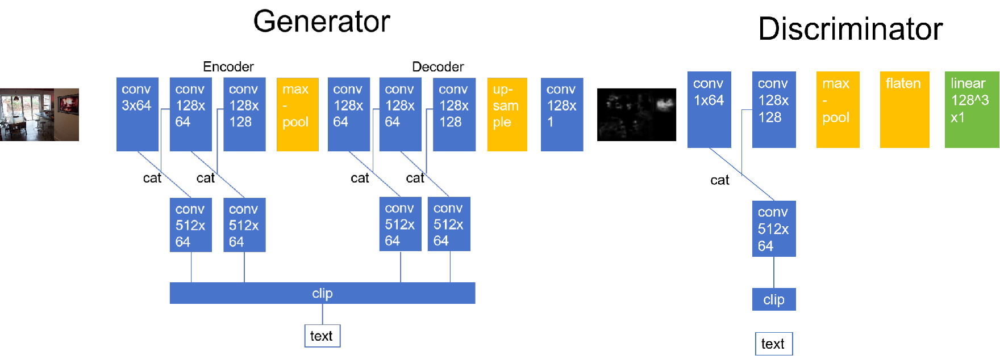
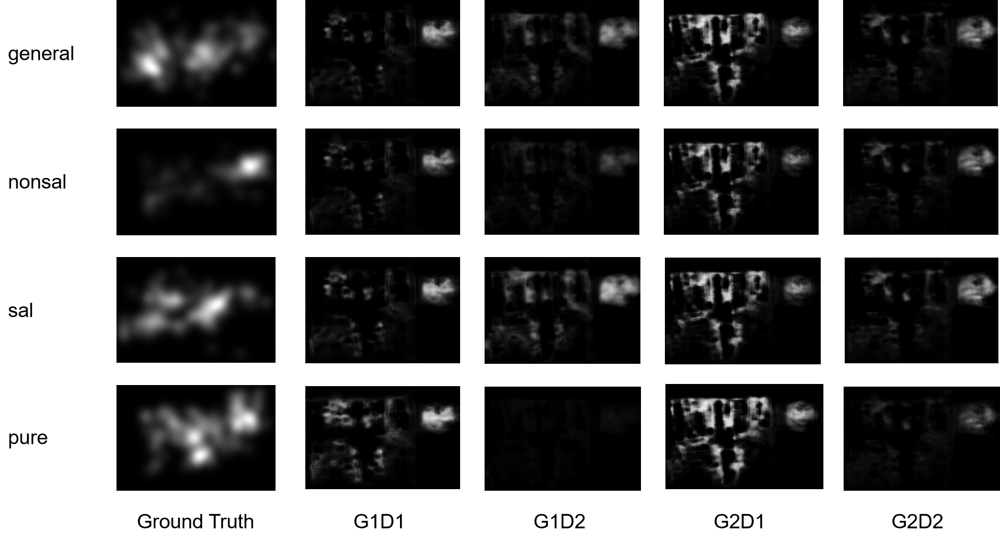
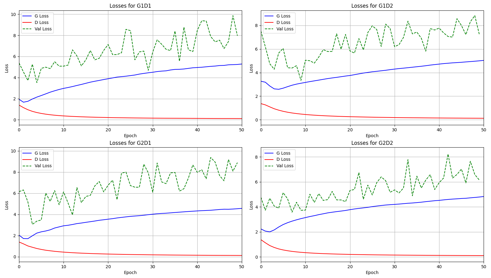

#  Text Aligned SalGAN

## Model Architecture



## Performance Display
+ ### Outputs



+ ### Training Loss
  
  

## Quick Start
```
conda install pytorch torchvision torchaudio pytorch-cuda=11.8 -c pytorch -c nvidia
pip install PIL
pip install matplotlib
pip install ftfy regex tqdm
pip install git+https://github.com/openai/CLIP.git
```
+ Write the image with its text description in the code(```apply_model.py```), for example:
+ download the dataset and put it in the cloned repo

```
your_cloned_repo/
|
|___ saliency/
|    |
|    |___ image/
|    |    |
|    |    |___ image1.png ...
|    |
|    |___ map/
|    |    |
|    |    |___ map1.png ...
|    |
|    |___ fixation/
|    |    |
|    |    |___ fixation1.png ...
|    |
|    |___ readme.txt
|    |
|    |___ text最终版本.xlsx
|
|___ other_dirs/

```


```
image_paths = ['saliency/image/000000001306_0.png']
    text_options = {
        "sal": "A table with chairs, a counter with stools and a big window",
        "nonsal": "A television was mounted on the kitchen wall.",
        "general": "A room with a TV, a table, a bar and floor-to-ceiling Windows",
        'pure': ''
    }
```
+ Execute ```python apply_model.py --help``` to check relevant information;
+ Execute ```python apply_model.py --model [model] --text [text_type]``` to predict the saliency map.

## Train
+ In ```train.py```, adjust the following code to fine tune the hyper parameters:
```
batch_size = 16
optimizer_G = torch.optim.Adam(generator.parameters(), lr=0.0002, betas=(0.5, 0.999))
optimizer_D = torch.optim.Adam(discriminator.parameters(), lr=0.0002, betas=(0.5, 0.999))
num_epochs = 50
```
+ Then run ```train.py```, and the model will be trained and restored;
+ If you want more fine-grained control over the division of the training set, the validation set, and the test set, please refer to the comment  
 in ```Data_Utils.py``` and ```get_data_part.py```.
